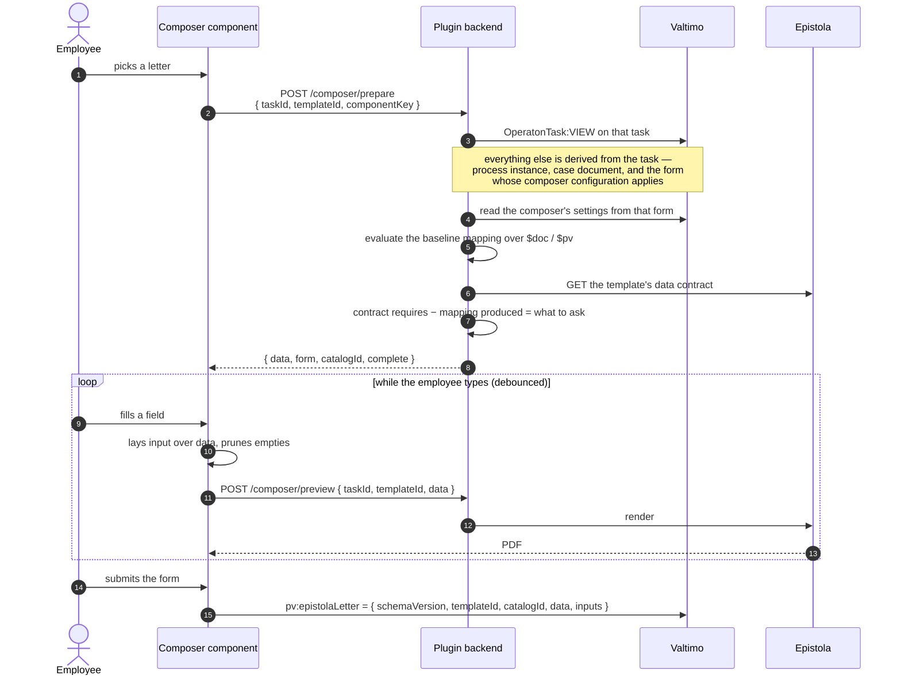
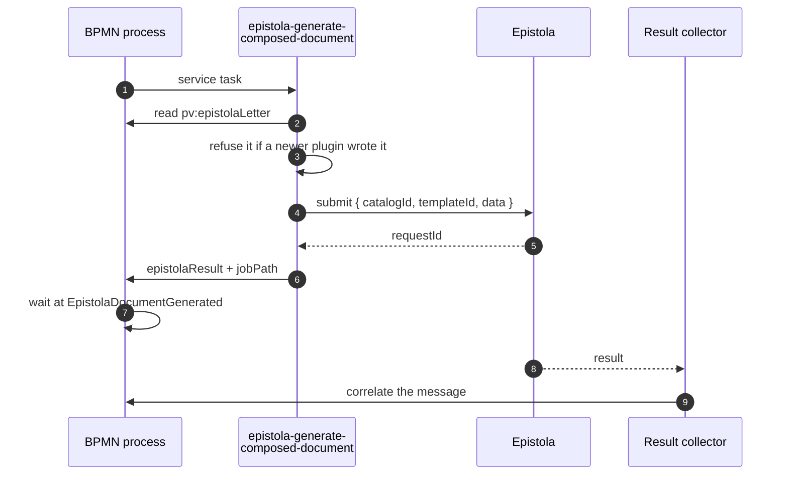
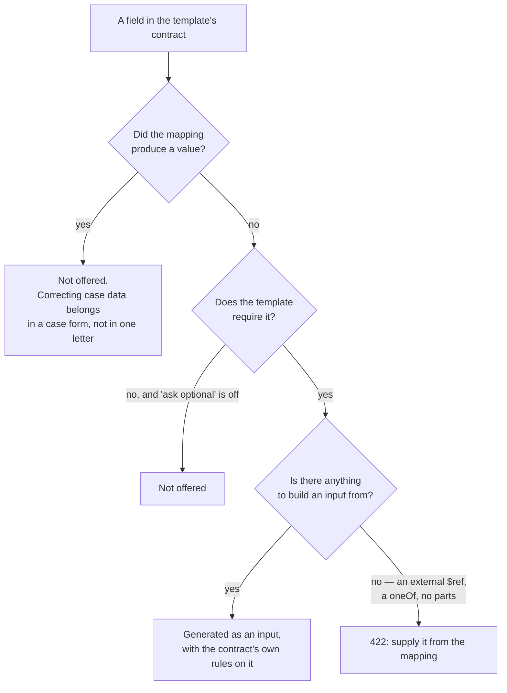
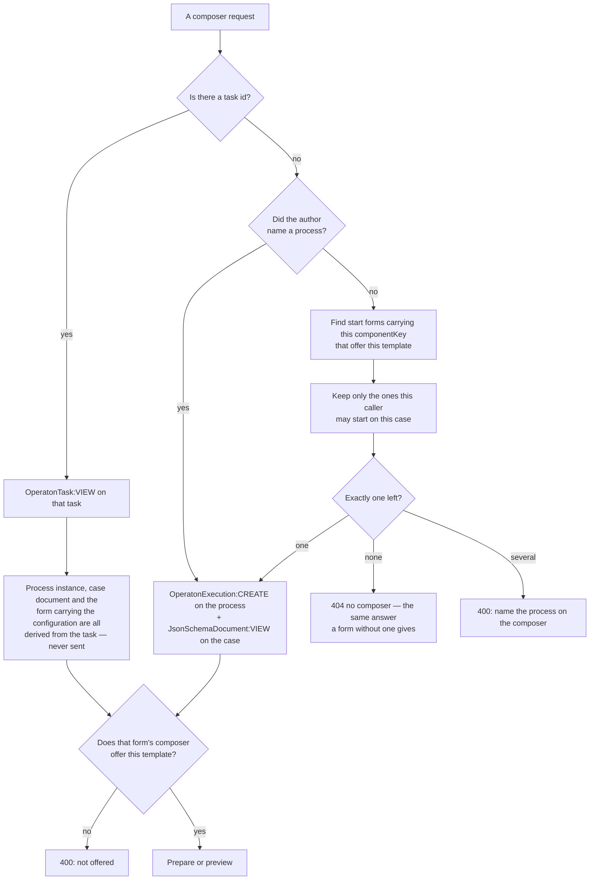

# Letter composer

One form component that offers a list of letters. The employee picks one, fills in whatever the
case could not supply, sees a live preview, and a single generate task renders whichever letter was
chosen.

The point is what it replaces. Offering ten letters used to mean ten blocks of input fields, ten
preview components with a hand-written override mapping each, show/hide logic per letter, and ten
service tasks in the BPMN. With the composer, **a form offering fifty letters is the same size as
one offering three**, and adding a letter is one row in the component's settings.

Where its configuration lives, and why, is [ADR 0006](adr/0006-letter-composer-configuration.md).

> **Alpha.** The composer works end to end and is covered by tests, but the shapes it stores may
> still change between releases. What it stores carries a `schemaVersion` so a change is safe to
> make — an older plugin refuses what a newer one wrote instead of misreading it (see
> [What it stores](#what-it-stores)) — but a case built on it now may need revisiting. The palette
> entry and the component's settings say so too, where an author will actually see it.

## It is a module of its own

Nothing else in the plugin depends on the composer, so it is kept together and switchable:

|            |                                                                                                                                                   |
| ---------- | ------------------------------------------------------------------------------------------------------------------------------------------------- |
| Backend    | `app.epistola.valtimo.composer` (+ `.web`), wired by `EpistolaComposerConfiguration`                                                              |
| Frontend   | `lib/composer/`, registered through one entry point (`registerEpistolaComposerComponents`) and calling one service (`EpistolaComposerApiService`) |
| Off switch | `epistola.composer.enabled=false` — no beans, no endpoints                                                                                        |

What it borrows, it borrows narrowly: the Epistola API, the JSONata mapping service, the Form.io
form generator, and the start-form gate it shares with the document preview. Its generation step is
an action on the plugin class, because Valtimo scans that class for actions, but the behaviour
lives in the composer's own `DynamicDocument`.

**Everything outside the module that knows it exists** — the whole list, so it stays short:

| Where                                                                                           | Why                                                                                                                                                                                          |
| ----------------------------------------------------------------------------------------------- | -------------------------------------------------------------------------------------------------------------------------------------------------------------------------------------------- |
| `EpistolaPluginAutoConfiguration` `@Import`s `EpistolaComposerConfiguration`                    | One line of wiring; the off switch lives inside the imported class                                                                                                                           |
| `EpistolaPlugin` imports `DynamicDocument`                                                      | Valtimo scans the plugin class for `@PluginAction`s, so the action must be declared there. It reads the letter and delegates; no composer logic lives in it                                  |
| `EpistolaRegistrationService` calls `registerEpistolaComposerComponents`                        | One entry point for all four Form.io components                                                                                                                                              |
| `epistola.specification.ts` names the action's configurator and spreads `COMPOSER_TRANSLATIONS` | Valtimo consumes one specification object, so the composer's half is composed into it rather than written there — see `composer/composer.translations.ts`, and the spec that guards the seam |
| `components/task-id-carrier.spec.ts` covers the composer too                                    | That suite is about Formio's serializer dropping schema equal to the default, which is a cross-cutting trap; it runs real formiojs with a harness not worth duplicating per component        |

Nothing else imports it, and the library's public API exports none of it.

**One asymmetry to know about:** `epistola.composer.enabled=false` removes the backend beans and
endpoints, but the frontend registers the composer's components unconditionally. Disabling it
server-side therefore leaves the palette entry and the process-link action type visible, and a form
built with them fails on the first call. The plugin-wide `EPISTOLA_ENABLED` does hide everything;
there is no composer-only equivalent, because a frontend flag has to be threaded through all the
places listed in [embedding.md](embedding.md). Disable the composer on environments where nobody
authors forms, or disable the plugin.

## How it works

The composer never holds a letter's fields. Choosing one asks the backend what this case already
answers and what is left over, and the answer is what gets rendered — in the preview and again at
generation, from the same snapshot.



Generation then renders exactly that variable — no template to pick, no mapping to write:



See [async.md](async.md) for the wait itself, which the composer does not change.

### Which fields the employee is asked for

Read from the mapping's **outcome**, never from its text — a mapping may be opaque
(`{"aanvrager": $doc.someObject}`) or computed, so which template field an expression feeds cannot
be known by reading it.



**A letter with a lot to fill in is stepped through.** Above six inputs the generated form is shown
as a wizard, with clickable breadcrumbs so a step is one click away. Steps are named by what the
contract already calls things: a group becomes a step with its name, a group that is a lot on its
own is split into numbered parts of it (`Aanvrager 1/2`), a step holding one field takes that
field's name, and only a step of several unnamed fields falls back to `Stap n`. Below the threshold
nothing changes. This happens in the browser (`composer-sections.ts`), not in the generator: it is
presentation only — same fields, same keys, same submission — so the generated form stays canonical
and the step titles can be translated.

**Which fields the employee is asked for is read from the mapping's outcome, never from its text.**
A mapping may be opaque (`{"aanvrager": $doc.someObject}`) or computed, so which template field an
expression feeds cannot be known by reading it. Evaluating it against the real case answers the
question directly: whatever the template requires and the mapping did not produce is what the
employee supplies. Fields the mapping _did_ fill are deliberately not offered — correcting case
data belongs in a case form, not in one letter.

## Configuring the component

| Setting                          | Meaning                                                                                                                                                                                                                                          |
| -------------------------------- | ------------------------------------------------------------------------------------------------------------------------------------------------------------------------------------------------------------------------------------------------ |
| **Property name** (`key`)        | Where the chosen letter is stored. Use a `pv:` key, e.g. `pv:epistolaLetter`, so the generate task can read it with `$pv`.                                                                                                                       |
| **Which letters, from where**    | Pick the Epistola connection and catalog, then tick the letters to offer and name each one as the employee should see it. The three cascade: changing the connection clears the catalog and the ticks, because those ids mean nothing elsewhere. |
| **Baseline mapping**             | One JSONata mapping over `$doc`/`$pv` for every offered letter. Whatever it does not fill is asked of the employee.                                                                                                                              |
| **Also ask for optional fields** | Off by default: only fields the template marks required are asked for.                                                                                                                                                                           |
| **Process to start**             | Normally left empty — see [Where it is used](#where-it-is-used). Fill it in only when the backend says two processes offer the same letter.                                                                                                      |

Stored, that half looks like this — under `epistola`, the one key this component claims on a form:

```json
"epistola": {
  "letterSet": {
    "pluginConfigurationId": "…",
    "catalogId": "municipality-demo",
    "templates": [{ "templateId": "besluit-bezwaar", "label": "Besluit op bezwaar" }]
  }
}
```

A per-letter `dataMapping` fragment is merged over the baseline, so the baseline says what every
letter of this case type needs and the fragment only what makes this one different.

### On a task form, a start form, or a form-flow step

A composer is found wherever the activity's process link leads. A **form** link gives its form
directly; a **form-flow** link gives the flow, and every form step in it is read — all of them
belong to the one task, so a caller who may open the task may reach any of them anyway, and naming
a step on the wire would be the browser saying where configuration is read from, which is exactly
what reading it server-side exists to prevent.

A form flow needs no authorization of its own: the task still exists and still gates the request.
What differs is only the lookup — a step stores its form by _name_, and a form name is unique only
within a case definition, so the flow and its forms are resolved against the case definition the
process belongs to. Every API it uses has been in Valtimo since 13.21, the plugin's floor,
so this costs no compatibility.

### Where it is used

Nothing says so. The same configuration works on a **user task form** and on the **start form** of
a process running on an open dossier, at the same time, and which one it is follows from where it
is opened:

- A task form fills the composer's hidden `epistola:taskId` carrier server-side, so a task id is
  present and the composer calls `/composer/prepare`, authorized on `OperatonTask:VIEW`.
- A start form fills no such carrier, so the composer calls `/composer/prepare/start` for the
  dossier on screen, authorized on `OperatonExecution:CREATE` plus `JsonSchemaDocument:VIEW`.

A task id always wins: a task form must not fall through to the start endpoint, which would read
another form's configuration and have no process instance for `$pv`.

**Which process a start form starts is worked out server-side.** A start form belongs to exactly
one process, but Valtimo hands a Form.io component nothing about the link that rendered it, so the
browser cannot know. The backend instead looks for the start forms carrying a composer with this
component's key that offers the chosen letter, narrows them to the processes the caller may
actually start on this case, and uses the single survivor. None → the same "no composer" answer a
form without one gets; more than one → it asks the author to fill in **Process to start**. Either
way the surviving definition goes through the same two gates as a named one, so discovery buys
convenience and changes no permission.

## Wiring it into a process

Three shapes, all shipped as demos on the `correspondentie` case. The composer is a Form.io
component, so it goes on a form like any other field; what differs is only which form.

### A letter as a step in a process

The ordinary case: somewhere in the process an employee has to choose a letter.

```
UserTask  choose-letter          → form "kies-brief"            (the composer)
                                    ↓  pv:epistolaLetter
ServiceTask generate-chosen-letter → action "Generate Dynamic Document"
```

Demo: `correspondentie-letter-composer`. To build one: drop the component on the task's form, set
its **Property name** to `pv:epistolaLetter`, choose the Epistola connection and the letters to
offer, then add a service task with the **Generate Dynamic Document** action reading the same
variable. The action needs no template, catalog or mapping of its own — the letter carries them.

### Without a composer at all

The generate action renders a **document object**; a composer is one way to produce one, not the
only way. Anything that can set a process variable can prepare a document — an earlier service task,
an integration, an API caller starting the process — and the action renders it without knowing where
it came from.

The whole contract is three fields:

```json
{
  "catalogId": "gemeente",
  "templateId": "besluit-bezwaar",
  "data": { "naam": "Jansen" }
}
```

`schemaVersion` may be omitted (absent means 1). A JSON _string_ works as well as an object, since
the engine hands back whichever the writer stored. From JVM code, build it rather than copying this
literal — `DynamicDocument.of(catalogId, templateId, data)` is the same contract, kept
in step with the reader by a round-trip test:

```java
execution.setVariable("epistolaLetter",
        DynamicDocument.of("gemeente", "besluit-bezwaar", Map.of("naam", "Jansen")));
```

Everything else behaves as it does for a composed letter: the filename defaults to the template's
id, the environment comes from the plugin configuration, and the rich result variable and the
`jobPath` correlation locator are written the same way, so the async catch-event pattern works
unchanged.

A letter composer writes more than this onto the same variable — what the employee typed, and where
those values also belong in the case — and `ComposedLetter` is that richer reading of it. Two types
over one wire shape, because the extra fields were doing the explaining: a document a process
prepared has no inputs and no write-back, and one type carrying them said otherwise every time
someone read it.

Two things such a document does **not** get, both by design rather than omission:

- **No write-back.** The rules live on a composer, so a document no composer produced has nobody to
  say where its values belong. Nothing is written and nothing is logged as wrong.
- **No check that the template was meant to be offered.** `requireOffering` guards the browser-facing
  prepare and preview endpoints; a BPMN action runs with the engine identity and trusts the process,
  as the plugin's other actions do. A process can therefore render any template in any catalog its
  plugin configuration can reach — which is the point of this shape, and worth knowing before using
  it.

### A letter inside a form flow

The same, where the task opens a flow rather than a single form. Every form step of the flow is
read, so the composer may sit on any step.

Demo: `correspondentie-flow-letter`, composer on `kies-brief-flow`.

**This one needs two extra pieces, and without them the generate task fails one step later.** A
form flow does not resolve `pv:` keys the way a plain form does, so the chosen letter never reaches
the process variable:

- the flow's `onComplete` needs the **three-argument** `completeTask`, naming the mapping
  explicitly: `{'pv:epistolaFlowLetter':'/pv:epistolaFlowLetter'}`;
- and because only the **completing** step's submission is mapped, a letter chosen on an earlier
  step needs a hidden component with the same key on the completing step to carry it forward.

Both are in the demo, and `BundledComposerFormTest` fails if either is removed.

### A letter sent ad hoc from an open case

No task at all. An employee looking at a dossier decides to send a letter; the composer sits on the
**start form of a small process of its own**, and submitting starts that process on the case
already on screen.

```
(open dossier) → start form "kies-brief-adhoc"   (the composer)
                   ↓  starts the process on this case document
                 ServiceTask generate-chosen-letter
```

Demo: `correspondentie-ad-hoc-letter`. Which process gets started is worked out server-side rather
than wired by the author — see [Where it is used](#where-it-is-used) — so if more than one process
has a start form offering the chosen letter, the author has to fill in **Process to start**.

### What each shape costs

|                                 | Task form           | Form-flow step                   | Ad-hoc start form                                      |
| ------------------------------- | ------------------- | -------------------------------- | ------------------------------------------------------ |
| Needs a user task               | yes                 | yes                              | **no**                                                 |
| `$doc` available to the mapping | yes                 | yes                              | yes                                                    |
| `$pv` available to the mapping  | yes                 | yes                              | **no** — there is no instance yet                      |
| Extra wiring                    | none                | `completeTask` mapping + carrier | **Process to start**, when ambiguous                   |
| Authorized on                   | `OperatonTask:VIEW` | `OperatonTask:VIEW`              | `OperatonExecution:CREATE` + `JsonSchemaDocument:VIEW` |

### Saving a letter's values on the case

A composer may declare where a letter's values also belong — **Also save these values on the case**
in its settings. Each rule is a destination and a JSONata expression over the letter:

| Destination               | Expression             | What happens                                                   |
| ------------------------- | ---------------------- | -------------------------------------------------------------- |
| `doc:/aanvrager/telefoon` | `$inputs.telefoon`     | the number the employee typed is saved on the case             |
| `pv:besluitType`          | `$inputs.decisionType` | it becomes a process variable the rest of the process can read |

`$letter` is the letter as it will be sent; `$inputs` only what the employee typed themselves. An
expression that yields nothing writes nothing, which is what keeps "only save what was actually
supplied" the default rather than clobbering good case data with nulls.

`$data` is the same object as `$letter`, under the name the contract uses — Epistola's API field is
`data`, and the stored letter has a `data` key, so an author reading the process variable sees that
name. Either works. There is deliberately no `$form`: in a form flow that already means one step's
submission, and these are the composer's own generated fields rather than the Valtimo form around
them.

The rules are applied **when the letter is generated**, by the generate task, once Epistola has
accepted it. So a letter Epistola refuses saves nothing — nothing was sent — while a save that
fails after acceptance is logged and the process carries on, because the letter is irreversible by
then and failing the activity would make a retry send a duplicate.

Three things to know before using it:

- **A `doc:` destination must already exist in the case schema.** A case with
  `additionalProperties: false` refuses an undeclared path, and the failure is a logged warning
  rather than a stopped process. The bundled demo writes to `pv:` destinations for exactly this
  reason.
- **The form decides where values may go, not the letter.** The expressions and destinations are
  read from the stored composer, never from the submission — the letter is assembled in the browser,
  so a crafted one could otherwise name any case path.
- **A rule with no destination or no expression is ignored**, with a warning. The settings widget
  says so while it is being written, and `BundledComposerFormTest` fails if a bundled form carries
  one.

Two limits apply to all three:

- **A generate task is required.** The composer only records what was chosen; nothing is sent
  without a service task to send it. A composer with no generate task downstream produces a process
  variable nobody reads.
- **One letter per composer.** The picker is a single select and the value is one letter. A form may
  carry several composers, each with its own `pv:` key and its own generate task, which is how a
  task sends more than one letter today — but letting the employee decide _how many_ go out is
  unbuilt ([#152](https://github.com/epistola-app/valtimo-epistola-plugin/issues/152)).

## What it can ask for

The inputs are generated from the template's data contract, so what the contract says decides what
the employee sees:

| In the contract      | Generated input                                                                                                                                                                                                                |
| -------------------- | ------------------------------------------------------------------------------------------------------------------------------------------------------------------------------------------------------------------------------ |
| `enum` / `const`     | `select` of exactly those values                                                                                                                                                                                               |
| `string`             | text field — `format: email` gives an email field; `format: date`/`date-time` give a text field with an explicit placeholder, because Formio's date picker emits a full ISO timestamp that a `"format": "date"` schema rejects |
| `number` / `integer` | number field                                                                                                                                                                                                                   |
| `boolean`            | checkbox                                                                                                                                                                                                                       |
| `array` of scalars   | one input with `multiple`                                                                                                                                                                                                      |
| `array` of objects   | datagrid, one column per item field                                                                                                                                                                                            |
| `object`             | fieldset, one input per property, nested                                                                                                                                                                                       |

**The contract's rules reach the input.** `required` and `enum` do the obvious thing, and
`minLength`, `maxLength`, `pattern`, `minimum`, `maximum`, `minItems` and `maxItems` are carried
onto the generated component's `validate`, so a value that cannot work is refused under the field
while it is being typed.

**Epistola stays the authority.** It validates every value against the contract when it renders,
and would still refuse anything wrong if none of this existed — what the form adds is _where and
when_ the complaint appears, not whether it happens. Two things follow. It need not be exhaustive:
`exclusiveMinimum`, `exclusiveMaximum` and `multipleOf` have no Formio validator, so they are left
to render time. And it must never be _stricter_ than the contract, because a rule the server would
have accepted becomes work the employee cannot submit at all — which is why a `pattern` gets
special handling: JSON Schema patterns _search_, Formio wraps what it is given as `^…$`, so an
unanchored pattern is wrapped to keep searching and an anchored one is passed through untouched.

An `enum` is left without length or pattern rules: the options are the constraint, and a rule on
top of them can only contradict what is offered.

**The messages are Formio's, in English** — _"Bsn does not match the pattern ^\d{9}$"_. Translating
them means wiring Formio's i18n into the nested form's options, which is not done yet.

**Local `$ref`s are compiled away; external ones are not.** The analyzer resolves `#/…` pointers
and merges them, so a contract that factors shapes out internally decomposes exactly as an inlined
one would. An external `$ref` — a `https://…` URL — is different: this plugin does not fetch
schemas, so all it ever sees is `{"$ref": "…"}`. With no `type` and no `properties` there is
nothing to infer, and the analyzer marks the field as needing "a complete-value mapping".

**A value with no separate fields to fill in is refused, not faked.** If the baseline mapping
leaves such a field empty and the template requires it, preparing the letter fails with a 422
naming the field and saying to supply it from the mapping. An _optional_ one is simply never
offered, and one the mapping fills is not a problem at all — which is the normal case. Two shapes
qualify:

- a structure that decomposed to no parts, so there is nothing to render;
- a scalar the analyzer could not see a scalar in — an external or recursive `$ref`, a `oneOf` of
  shapes, an empty schema.

The second is why the check covers scalars at all. An external `$ref` infers **`SCALAR`**, because
`{"$ref": "…"}` has neither `type: object` nor `properties`, so without it the field would have
become a single-line text box for a value that is not text.

What the check deliberately does **not** ask is whether the analyzer flagged the field `complex`.
That flag belongs to the mapping builder — "Simple mode must map this as one expression" — and an
ordinary array of objects carries it while decomposing into a data grid perfectly well. Rendering
asks a different question.

**Rich text is not supported.** How the contract carries it decides what happens:

| How the contract carries it                       | What happens                                                                                                                        |
| ------------------------------------------------- | ----------------------------------------------------------------------------------------------------------------------------------- |
| External `$ref` (a shared rich-text schema URL)   | Marked complex, so refused with the 422 above when it is required and unmapped                                                      |
| Inlined — a plain object with ordinary properties | **Not detected.** Indistinguishable from any other object, so it renders as a fieldset asking for the document’s internal structure |

Nothing in this plugin reads a rich-text marker from a contract — not the composer, not the mapping
builder, not the retry form — so the inlined case has nowhere to be caught. Supporting rich text
properly means recognising the marker and offering an editor for it, which is its own change and
not part of the composer. Until then, supply rich-text fields from the baseline mapping rather than
offering a letter that asks for them.

## What it stores

Three structures, in three places, with three lifecycles. Two of them outlive the code that wrote
them, so both carry `schemaVersion` — read tolerantly downwards (absent means 1, so nothing
deployed before the field existed is invalidated) and refused upwards, loudly, with a message
naming both versions. The rule is written once, in `ComposerSchema`, and mirrored in
`composer-schema.ts`.

**1. The component's settings**, in the form definition — versioned with the case definition,
deployable as config-as-code, editable in the builder:

```json
{
  "type": "epistola-letter-composer",
  "key": "pv:epistolaLetter",
  "prefill": false,
  "epistola": {
    "schemaVersion": 1,
    "askOptionalFields": false,
    "dataMapping": "<baseline JSONata>",
    "letterSet": {
      "pluginConfigurationId": "…",
      "catalogId": "municipality-demo",
      "templates": [{ "templateId": "besluit", "label": "…", "dataMapping": "<fragment>" }]
    }
  }
}
```

**Everything this component owns lives under `epistola`.** That component object is not ours: it
holds Form.io's own properties — `key`, `label`, `validate`, `prefill` — and whatever another
custom component on the same form puts there. `dataMapping` and `schemaVersion` are names anyone
could reasonably claim, so one key is claimed instead of five. `prefill` stays outside it, because
it is Form.io's own property and Form.io is the one that reads it.

`epistola.schemaVersion` and `prefill` are written back on every save, because Form.io drops schema
equal to the registered default and losing either is silent. The namespace is rewritten as a whole
object, so stamping the version must not drop the settings beside it — pinned by a unit test.

**A catalog is a property of the letter, not of the set.** `letterSet.catalogId` is the default; a
letter may carry its own `catalogId`, which is what lets one picker offer letters from more than
one catalog. A letter with neither is dropped with a warning — which catalog a letter comes from
decides what is rendered, and there is nothing to guess. The settings widget writes only the
default today; a hand-written form can already do both.

**The wire carries the catalog too.** A prepare or preview request may name a `catalogId` beside
the `templateId`, and the picker sends whichever catalog the form gave the chosen letter. It stays
optional, because a template id is unique within a catalog and a composer usually offers one — but
a composer offering two can hold the same id twice, and the backend refuses to guess between them
rather than rendering whichever happened to be configured first.

A form written by hand may leave out either level: the settings directly on the component instead
of under `epistola`, and `pluginConfigurationId`, `catalogId` and `templates` directly instead of
under `letterSet`. All of those shapes are read — the namespace when it is there, the component
itself when it is not.

**2. The chosen letter**, on the process variable the component's `pv:` key names:

```json
{ "schemaVersion": 1, "templateId": "…", "catalogId": "…", "data": { … }, "inputs": { … } }
```

`data` is everything the letter renders with; `inputs` is only what a human typed, kept so it stays
visible what was changed by hand — and it is what write-back will read. This is the structure with
the longest reach: a process instance can wait months for its generate task, so the plugin that
reads it may not be the one that wrote it.

**3. The generate action's configuration**, on the process link — `letterVariable`, `filename`,
`correlationId`, `resultProcessVariable`. Plain flat properties, covered by the plugin's existing
action-configuration versioning.

### Does the shape take what is still missing?

Everything in [Known gaps](#known-gaps) was checked against the three stored shapes before this
shipped, because they are the part that cannot be changed cheaply once cases are deployed on it.
The question asked of each was not "is it built" but "would building it change a shape rather than
add to one".

| Still missing                                                               | What the shape needs                                                                        | Takes it today?                                                                                                                                                                 |
| --------------------------------------------------------------------------- | ------------------------------------------------------------------------------------------- | ------------------------------------------------------------------------------------------------------------------------------------------------------------------------------- |
| Write-back                                                                  | `writeBack` on the settings; the resolved values on the letter; a write error on the result | Additive object keys                                                                                                                                                            |
| Variant selection                                                           | `variantId` per offered letter; the resolved one on the letter                              | Additive, with a `schemaVersion` bump — an older plugin ignoring it would render the default, which is a different document. That is the mechanism working, not a shape problem |
| **Several letters at once**                                                 | The letter variable holding more than one                                                   | **This one did not.** See below                                                                                                                                                 |
| Rich text                                                                   | A marker in `FieldHints`; a per-template presentation override                              | Additive; `templates[]` is a list of objects                                                                                                                                    |
| Per-template mapping fragment                                               | `templates[].dataMapping`                                                                   | Already there; only the widget is missing                                                                                                                                       |
| Catalog-qualified letters                                                   | `catalogId` beside `templateId` on the wire                                                 | Additive request field; storage already holds a catalog per letter                                                                                                              |
| Form flows (now supported)                                                  | Nothing stored — a second resolution path, and the task still gates it                      | No stored shape involved                                                                                                                                                        |
| Nested objects in array items, message translation, the frontend off switch | Nothing stored                                                                              | No stored shape involved                                                                                                                                                        |

**The one that did not take it was the letter variable**, which held a single letter and whose
reader refused anything else. Letting an employee choose _how many_ letters go out would therefore
have been a breaking change to a structure that outlives the plugin writing it. So the reader now
also accepts the envelope that feature will use:

```json
{ "schemaVersion": 1, "letters": [{ "templateId": "…", "catalogId": "…", "data": {} }] }
```

Nothing writes it. `DynamicDocument.allFrom` reads both shapes, and `from` refuses more than one
letter with a sentence saying to offer a composer per letter — so the unbuilt behaviour fails
loudly instead of generating the first and dropping the rest. When multi-letter lands it is a
behaviour change, not a migration.

## Wiring the process

One service task generates whatever was chosen, with the **`epistola-generate-dynamic-document`**
action:

```json
{
  "letterVariable": "epistolaLetter",
  "resultProcessVariable": "epistolaResult"
}
```

That is all it needs: the composer already resolved the catalog, the template and the data while
the employee was looking at the preview, so this action has no template to pick and no mapping to
write. It also names no **variant**, so a composed letter is always the template's default one —
see [Known gaps](#known-gaps). It is deliberately **not** a mode of `generate-document`: that action's configurator is
built around choosing a template and mapping to it, and the admin page verifies those ids really
exist — neither means anything here.

Waiting for the result is unchanged — see [async.md](async.md).

`data` is what the letter is rendered with, in the preview and at generation, so **what was
previewed is what gets generated**. It is a snapshot: if the case changes between the form and
generation, the letter still carries what the employee approved.

## A composer is never prefilled

The component's key is a `pv:` one, so the chosen letter becomes a process variable when the form
is submitted. Reading it back is another matter, and the component carries `prefill: false` for it:
Valtimo resolves a `pv:` key against the case's process instances when it prefills a form, and once
a dossier has run the process twice — two instances holding `epistolaLetter` — it cannot pick one
and fails the **whole form** with a 500. There is nothing to prefill either; the letter is what the
employee is about to choose.

Form.io drops component schema that equals the registered default, so the flag is re-added on save
the same way the hidden carriers are. `BundledComposerFormTest` pins it for every bundled form.

## Authorization

Two paths, each enforcing its own gate. Which one is taken follows from the context (see
[Where it is used](#where-it-is-used)) and nothing about authorization rides on that reading: a
caller could address either endpoint directly, and the one they reach checks what it checks.



Three properties are worth stating plainly:

- **The configuration is never sent.** The browser names a template, and the mapping, catalog and
  plugin configuration are read from the stored form. So the worst a crafted request can do is ask
  for a letter the caller can already open the form for.
- **Discovery grants nothing.** Candidates are narrowed by the same two gates _before_ anything is
  reported, so a caller who may start nothing gets the "no composer" answer rather than a list of
  processes they have no part in — and the survivor goes through the gates again as a named one
  would.
- **Naming the wrong process fails.** The component names itself (`componentKey`), so an authored
  `processDefinitionKey` pointing elsewhere finds no composer by that key and is refused, instead
  of quietly composing with that other process's settings.

Both start-form gates live in one `StartEventAuthorization`, shared with the document preview so
they cannot drift apart — the reasoning is [ADR 0004](adr/0004-start-event-preview-authorization.md).
See also [authorization.md](authorization.md).

## Dropdowns, dates and other input shapes

Generated inputs follow the template's data contract:

| In the contract                    | Input                                                                                                                     |
| ---------------------------------- | ------------------------------------------------------------------------------------------------------------------------- |
| `enum` / `const`                   | a select of exactly those values                                                                                          |
| `title`                            | the field's label (beats a humanized property name)                                                                       |
| `description`                      | the tooltip                                                                                                               |
| `default`                          | prefills an empty field                                                                                                   |
| `"format": "email"`                | an email component                                                                                                        |
| `"format": "date"` / `"date-time"` | a text field with an explicit placeholder — Formio's date picker emits a full timestamp, which `"format": "date"` rejects |
| array of scalars                   | one repeating input                                                                                                       |
| array of objects                   | a datagrid                                                                                                                |

So the first place to fix "this should be a dropdown" is the template's contract in Epistola, where
every integration benefits — not just Valtimo.

## Demo

The **Correspondentie** case ships the demo, `correspondentie-letter-composer`:

- `form/kies-brief.form.json` — the composer, offering two letters over one baseline mapping.
- `bpmn/correspondentie-letter-composer.bpmn` — choose → generate → wait.
- `process-link/correspondentie-letter-composer.process-link.json` — the v2 generate link.

Choosing **Ontvangstbevestiging bezwaarschrift** asks for nothing: the case fills its whole
contract. Choosing **Besluit op bezwaar** asks for the three decision fields the case does not
know, and previews the letter once they are filled in.

**Bevestiging omgevingsvergunning** is the third letter on purpose: a permit confirmation offered
from a bezwaar case, which has none of its data. The baseline mapping fills nothing of its twelve
required fields, so it is the one that crosses the threshold and is stepped through — `Property`,
`Applicant` and `Activities`, all three named by its own contract. Use it to see sectioning; the
other two stay one short form, which is the point.

The same case also ships `correspondentie-ad-hoc-letter`: the composer on a start form, started
from the dossier's Start menu, generating without a task.

`LetterComposerE2ETest` walks the task-based demo against the real bundled contracts; the Playwright
suites (`e2e/tests/letter-composer.spec.ts` and `letter-composer-adhoc.spec.ts`) walk both in a
browser.

**Why its own case, rather than a second process on the Bezwaarprocedure case:** a case with two
startable processes makes Valtimo show a process picker before the start form, and in this version
its tiles are anchors with `href="#"` — clicking one reloads the app instead of opening the form,
which leaves _both_ processes unstartable. One startable process per demo case avoids that
entirely.

## Known gaps

Each of these is tracked, so the list below is the explanation and the issue is the state:
[#149](https://github.com/epistola-app/valtimo-epistola-plugin/issues/149) write-back to the case ·
[#150](https://github.com/epistola-app/valtimo-epistola-plugin/issues/150) validation messages ·
[#151](https://github.com/epistola-app/valtimo-epistola-plugin/issues/151) variant selection ·
[#152](https://github.com/epistola-app/valtimo-epistola-plugin/issues/152) more than one letter ·
[#153](https://github.com/epistola-app/valtimo-epistola-plugin/issues/153) frontend off-switch ·
[#154](https://github.com/epistola-app/valtimo-epistola-plugin/issues/154) retrying a composed letter ·
[#155](https://github.com/epistola-app/valtimo-epistola-plugin/issues/155) per-template mapping in the builder ·
[#20](https://github.com/epistola-app/valtimo-epistola-plugin/issues/20) rich text.

The first one below is **accepted rather than open** — it has no issue because closing it would cost
the promise the composer makes. The rest are open.

- **The browser assembles `data`.** A crafted submission could carry values for fields that were
  never offered. The employee can already write the letter's text, so this is a governance limit
  rather than an escalation, but a form that must not allow it should keep using a hand-built form
  and a `generate-document` link per letter.

  _This one is accepted rather than open._ The only fix that closes it is re-resolving the mapping
  server-side at generation and ignoring what the browser sent — which would break the promise the
  whole design rests on, that what was previewed is what gets generated. It is a consequence of the
  composer computing while the employee watches, not an oversight, and it is not expected to change.

- **Every composed letter uses the template's default variant.** Neither the preview nor the
  generate action names a variant, so the three selection modes `generate-document` offers —
  default, an explicit `variantId`, attribute-based — reduce to the first. Preview and generation
  agree on it, so nothing is misleading; there is simply no way to choose.

  Adding it means resolving the variant **when the letter is composed** rather than at the service
  task, because the composer's promise is that what was previewed is what gets generated: an action
  that selected a variant from attributes while the preview had not would send a document the
  employee never saw. So the resolved variant belongs on the letter variable next to `catalogId`
  and `templateId`, with both the preview and generation using it — most likely offered per letter
  in the settings widget, and resolved from the mapping context for attribute-based selection.

  It is also a real `schemaVersion` case rather than an additive field: an older plugin reading a
  letter that names a variant would ignore it and render the default — a different document than
  the one approved — so `ComposerSchema.CURRENT` must be raised when it lands.

- **A failed composed letter has no retry form.** `epistola-retry-form` rebuilds its inputs from a
  `generate-document` link's own template and data mapping, and asks the employee to correct what
  that mapping produced. A composed letter has neither: the template was chosen by the employee and
  the data was resolved while they watched, both living on a process variable rather than in the
  link. So the retry component finds no link and offers nothing.

  Retrying a composed letter means composing it again — the same component, on a task the process
  routes to when generation fails, reading nothing from the previous attempt. That is a form the
  author already knows how to build; what is missing is the composer reading the failed letter back
  so the employee corrects rather than retypes, which needs the composer to accept an initial value
  (it deliberately sets `prefill: false` today, see [A composer is never prefilled](#a-composer-is-never-prefilled)).

- **No write-back to the case.** Input stays with the letter: the composer's generated fields live
  in a nested Form.io instance and collapse into the component's single `pv:` value, so the
  field-level write-back Valtimo does for a `doc:`-keyed form field never sees them. Until it
  exists, a value that belongs in the case should be collected in a case form, where the preview
  picks it up from the field key — see [document-preview.md](document-preview.md).

  The design is settled and written up in
  [ADR 0006](adr/0006-letter-composer-configuration.md#write-back-is-a-map-from-case-path-to-expression-evaluated-after-the-letter-is-composed):
  an `epistola.writeBack` map on the component, keyed by the **destination** and valued with a JSONata
  expression over `$inputs` / `$data` / `$doc` / `$pv`. It is evaluated when the letter is composed
  and the _result_ rides on the letter variable next to `data`, so the write uses what the employee
  approved even when the applying task runs long afterwards. The **generate action applies it**, once
  Epistola has accepted the letter — one composer produces one letter which one generate task
  renders, so there is nothing to coordinate and nothing an author can forget to wire. A refused
  submission throws as it does today, so nothing is written for a letter that was never sent; a
  write that fails _after_ acceptance is recorded on the result variable rather than thrown,
  because the letter is irreversible by then and failing the activity would make a retry generate a
  duplicate. Keying by destination is what keeps one writer per case
  path and lets a destination be computed from several inputs; an expression yielding nothing
  writes nothing, so a value the employee never supplied never clobbers the case. The same map also
  makes the preview more faithful rather than less — applied to a copy of `$doc`/`$pv` before the
  baseline mapping runs, it shows the letter as it will be _once saved_.

- **Labels come from the contract.** A field with no `title` is labelled by humanizing its property
  name, so an English property name shows an English label in a Dutch form. The fix belongs in the
  template's data contract, where every integration benefits.
- **Epistola's own complaint about the data is still one message, not a field.** The browser's half
  of this is done: a value that breaks a rule the contract put on the field is explained in the
  reader's language, and a `pattern` failure leans on the field's description instead of printing
  the expression (`composer-messages.ts`). But the browser only checks the fields it offered. The
  rest of `data` comes from the baseline mapping, and when Epistola refuses _that_, the preview
  fails with a single string above it. Contract 1.4.0 answers a failing preview with
  `template-data-invalid`, carrying a JSON Pointer per bad or absent field, so those pointers can be
  attached to the generated inputs the same way — that is the remaining half of
  [#150](https://github.com/epistola-app/valtimo-epistola-plugin/issues/150).
- **Rich text is unsupported**, and a rich-text object that looks like a plain object is not even
  detectable here — see [What it can ask for](#what-it-can-ask-for).

  _Direction, and it starts elsewhere._ Nothing in this plugin reads a rich-text marker from a
  contract, and whether Epistola exposes one is an Epistola-side question that has to be answered
  first. Given a marker, the plugin side is small: the schema analyzer reads it into
  `FieldHints`, and the generator renders an editor component instead of a fieldset. The
  per-template presentation override ADR 0006 describes is where an author would pick one
  otherwise. Until the marker exists, supply rich-text fields from the baseline mapping.

- **A per-template mapping fragment is not authorable in the settings widget.** The backend merges
  one and a hand-written form can set it; the widget captures template and label only.
- **One letter per composer, and the count is authored rather than chosen.** The picker is a
  single select and the component's value is one letter, so a composer produces exactly one. A form
  may carry several composers — each with its own `pv:` key, each resolved by its own
  `componentKey` — and a generate task per key, which is how a task sends more than one letter
  today. What is not possible is letting the employee decide _how many_ go out: "pick two of these
  five and send both" needs the selection to be a list, the value to become `{ "letters": [ … ] }`
  (which `DynamicDocument` refuses today, since it requires a template at the top level), and the
  generate step to loop or the process to fan out.

  If you do put several on one form, note that a composer left unchosen sets no variable at all,
  and its generate task then fails with "No composed letter on process variable '…'" — deliberately
  loud rather than silently generating nothing. An _optional_ second letter therefore needs a
  gateway checking that variable before the service task.

- **The off switch is backend-only.** `epistola.composer.enabled=false` removes the beans and the
  endpoints, but the frontend registers the components unconditionally, so the palette entry and
  the process-link action type stay on offer — an author can build a form that fails on its first
  call. A frontend flag has to be threaded through every place [embedding.md](embedding.md) lists,
  so until then, disable the whole plugin or accept that authoring stays visible.
